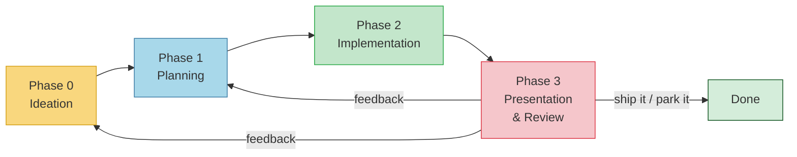

# Modus Operandi

> How Tomas and the AI Team build things together.
> This document is itself iterative — we improve it after every project.

---

## 1. Principles

- **KISS.** Keep It Simple Stupid. The simplest solution that works is the right one.
- **Good enough.** Don't chase perfection — chase "works well, ships now." Polish in later iterations if needed.
- **Iterative by nature.** Every project goes through multiple cycles. No phase is ever "final" — feedback loops drive improvement.
- **Record everything that matters.** Not just deliverables but key decisions, rejected alternatives, and the reasoning behind choices. Future us should understand *why*, not just *what*.
- **Skills accumulate.** The team records what it learns in `SKILLS.md` files — concrete capabilities gained from real project work. These are reference material for future projects, not ceremony to read before every phase.
- **Run it or it doesn't count.** Every deliverable must be executable. The team self-corrects by actually running the solution, not just reading the code. If the project processes real-world data, it must be tested against real-world data from the first implementation — not synthetic or toy data. Synthetic-only runs give false confidence.
- **Human time is precious.** When Tomas needs to act, surface it clearly — prefer web UI for human tasks, send notifications when action is waiting.
- **Everything in containers.** All services run in Docker — no installing packages on the host. Containers are reproducible, portable, and don't require sudo. If it needs a daemon, it gets a `docker-compose.yml` entry.

---

## 2. Repository Structure

Workflow artifacts (plans, decisions, iterations) live separately from deliverables (code, configs, tests). This keeps project management noise out of the actual product.

```
/
├── MODUS_OPERANDI.md              # This file — how we work
│
├── todo.txt                       # Idea backlog (until dashboard exists)
│
├── team/                          # Domain skills reference
│   ├── developer/
│   │   └── SKILLS.md              # Distilled skills & expertise gained from projects
│   ├── qa/
│   │   └── SKILLS.md
│   ├── security/
│   │   └── SKILLS.md
│   └── ...                        # New domains added as needed
│
├── templates/                     # Templates for standard artifacts
│   └── PROJECT.md                 # Project overview template
│
├── project-management/            # Workflow artifacts — plans, decisions, iterations
│   ├── <ABC>-<project-name>/      # 3-letter code (uppercase) + descriptive name
│   │   ├── PROJECT.md             # Overview, status, current iteration (see templates/)
│   │   ├── ASSUMPTIONS.md         # Design decisions, rationale, affected areas
│   │   ├── iterations/
│   │   │   ├── 001-ideation.md    # Brainstorm, requirements, decisions
│   │   │   ├── 002-planning.md    # Plan checklist, test requirements, decisions
│   │   │   ├── 003-implementation.md  # Run log, bugs found/fixed, decisions
│   │   │   ├── 004-review.md      # Feedback, next iteration plan
│   │   │   ├── 005-implementation.md  # Second implementation pass
│   │   │   └── ...
│   │   └── diagrams/              # Architecture, flow, sequence diagrams
│   │       └── architecture.md    # Mermaid/ASCII diagrams
│   └── ...
│
├── projects/                      # Deliverables — actual code and tests
│   ├── <ABC>-<project-name>/
│   │   ├── README.md              # Brief: what it is, how to run it, how to test it
│   │   ├── src/
│   │   └── tests/
│   └── ...
│
└── knowledge/                     # Cross-project shared reference material
    └── ...                        # e.g., "liferay-dxp-modules.md", "ci-pipeline.md"
```

### Documentation Standards

- **`README.md`** in `projects/` folder: what it is, how to run it, how to test it.
- **`PROJECT.md`** in `project-management/` folder, created from `templates/PROJECT.md`: project name, 3-letter code, status, current phase, lead, and overview diagram.
- **`ASSUMPTIONS.md`** in `project-management/` folder: non-obvious design decisions with ID, decision, rationale, and affected area. Answers "why did we do it this way?" for every non-obvious choice.
- **Diagrams** use Mermaid syntax in Markdown. Stored in `project-management/<project>/diagrams/`.
- **Iteration files** are flat — one `.md` per phase, numbered sequentially. Each contains its own decisions section at the bottom.
- **`knowledge/`** holds cross-project shared reference material — not domain-specific skills, not event logs.

Only `README.md` is mandatory for every project. The lead applies proportional effort — a half-day script doesn't need the same documentation as a multi-month platform.

---

## 3. Skills & Domain Knowledge

The `team/` directory stores accumulated domain expertise in `SKILLS.md` files, organized by domain (developer, qa, security, etc.). These are reference material — concrete capabilities gained from real project work.

### How SKILLS.md works

- Updated **after each human-reviewed iteration** with new capabilities gained. Not after every commit.
- Records **what we can now do**, not what happened. Good: "Build parameterized SQL WHERE clauses from URL query params with include/exclude lists." Bad: "In iteration 008, we added filter support."
- Shared cross-project learnings go in `knowledge/` (accessible across domains).
- Consult SKILLS.md when it's useful context for the current work — don't read them ceremonially before every phase.

---

## 4. Project Lifecycle

Every project follows this lifecycle. Each phase produces artifacts that get committed.



### Phase 0: Ideation

**Trigger:** A vague goal (e.g., "automox agent")
**Output style:** Exploratory, verbose — cast wide, don't converge too early
**Typical process:**
1. Tomas states the idea in any form — a sentence, a sketch, a rant
2. Brainstorm: ask questions to give the idea concrete shape
3. Key decision: **Is this code or a brainstorm?** Not everything needs implementation
4. If it involves human tasks → prefer a web UI approach
5. Decide the **project name** with a **3-letter identifier** in uppercase (e.g., `DSH-dashboard`, `SCA-supply-chain-audit`). The 3-letter code is used consistently across `project-management/`, `projects/`, and commit messages.

**Artifacts:** `project-management/<project>/iterations/NNN-ideation.md` containing brainstorm notes, requirements, and decisions
**Commit:** All ideation artifacts, including rejected ideas and the reasoning

### Phase 1: Planning

**Output style:** Structured — checklists, criteria, clear decisions
**Typical process:**
1. Create a checklist/plan from the requirements
2. Write test requirements FIRST (TDD) — what must pass for this to be "done"
3. Review the plan against the safety checklist (§7)
4. Flag any performance or efficiency concerns early
5. Produce an architecture diagram (Mermaid) if non-trivial — committed to `diagrams/`

**Artifacts:** `project-management/<project>/iterations/NNN-planning.md` (checklist, test requirements, decisions) + `diagrams/architecture.md`
**Commit:** Plan, test requirements, diagrams, and all decision rationale

### Phase 2: Implementation

**Output style:** Terse — code, run results, bugs fixed
**Typical process:**
1. Implement according to the plan
2. Write tests alongside code (TDD)
3. **Must actually run the solution** — not just write it
4. Self-correct loop: run → find bugs → fix → run again
5. Verify against the safety checklist (§7) before marking complete
6. Update `projects/<project>/README.md` — brief: what it is, how to run, how to test
7. Update documentation before presenting for review:
   - `SKILLS.md` — new capabilities gained from this implementation
   - Diagrams — updated if architecture changed
   - `ASSUMPTIONS.md` — updated if decisions changed

**Artifacts:** `projects/<project>/` (working code + tests) + `project-management/<project>/iterations/NNN-implementation.md` (run log, bugs found/fixed, decisions)
**Commit:** Code, tests, README, documentation updates, and run log

### Phase 3: Presentation & Review

**Typical process:**
1. Present the solution to Tomas in a way he can run it himself
2. Clear instructions: how to run, what to expect, what to look at
3. **Tomas reviews it.** This is the iteration boundary — only Tomas's review counts.

**An iteration requires human review.** Intermediate commits during implementation are encouraged, but they don't trigger SKILLS.md updates. The team can self-test and fix bugs freely — that's normal development. An "iteration" is the full cycle that ends with Tomas saying "next" or "fix this."

**Artifacts:** `project-management/<project>/iterations/NNN-review.md` (feedback, next iteration plan)
**Commit:** Feedback and iteration plan

### Post-Review: Lessons Learned

After each human-reviewed iteration (before starting the next cycle):

- Amend this Modus Operandi if the process itself needs changing
- Feedback feeds back into Phase 0 or Phase 1 depending on scope — the cycle repeats until Tomas says "ship it" or "park it"

### Exploratory Projects (POC)

Some projects start as a proof of concept where the scope evolves based on what the POC reveals. This is normal — a POC that changes direction based on results is working as intended, not suffering from scope creep. When this happens:

- Each direction change is a natural iteration boundary — present findings to Tomas, decide next direction together
- If the POC outgrows its original architecture, trigger the Pivot Protocol below
- Keep `PROJECT.md` updated so the current direction is always clear

**Scope changes require Tomas's sign-off.** If something that was explicitly "out of scope" becomes "in scope," or if the fundamental assumptions of the project change, that's not a bug fix — it's a scope change. Flag it for Tomas before implementing.

### Pivot Protocol

When the delivery architecture fundamentally changes (e.g., rewrite from shell scripts to Go, switching frameworks, replacing a core dependency), the project must:

1. **Update acceptance criteria first** — before continuing implementation. The criteria must match the new architecture. This happens in the same commit as the pivot decision.
2. **Keep iteration numbering continuous** — no resetting. Tag the pivot point in git (e.g., `v1-final`) so the boundary is clear without renaming files.
3. **Update `ASSUMPTIONS.md`** — what assumptions are now invalid? What carries forward?
4. **Tag the old delivery in git** — not as a `deprecated/` folder sitting in the repo.

A pivot without updated criteria means all subsequent "testing against criteria" is theater.

---

## 5. Priority & Time Tracking

### Priority

Every project gets an Eisenhower quadrant (Q1: urgent+important → do now, Q2: important → schedule, Q3: urgent only → simplify/delegate, Q4: neither → park/drop). Set during Ideation, reassessed at each Review.

### Time Tracking

All artifacts carry timestamps so we can trace the timeline of any project:

- **PROJECT.md** header includes: created date, last updated, current phase start date
- **Iteration files** include: start date, end date (when phase concluded)
- **Decision entries** include: date + time of decision
- **SKILLS.md updates** include: date of update

Format: `YYYY-MM-DD` for dates, `YYYY-MM-DD HH:MM` when time precision matters.

---

## 6. Decision Log Format

Decisions are recorded inline at the bottom of each iteration file. Each entry follows this format:

```markdown
### [Decision Title]
**Date:** YYYY-MM-DD HH:MM
**Phase:** Ideation | Planning | Implementation | Review
**Decided by:** [who]
**Decision:** What was decided
**Alternatives considered:** What else was on the table
**Reasoning:** Why this choice was made
**Revisit if:** Conditions that would make us reconsider
```

---

## 7. Safety Checklist

Verify against this checklist during Planning (§4 Phase 1) and before marking Implementation complete (§4 Phase 2). Not every item applies to every project — use judgment.

### Security
- No secrets in code — use `op`/Keychain, environment variables, or stdin pipe
- Parameterized SQL for all user input (no string interpolation)
- HTML output escaped by default (`html/template`, not `text/template`)
- CSRF protection on all state-changing POST endpoints
- Input validation and length limits at system boundaries
- Auth required on all endpoints (session for UI, JWT for API)

### Quality
- Tests written alongside code (TDD when practical)
- No shipping without passing tests
- Actually run the solution — don't just read the code

### Performance
- Flag efficiency concerns on critical paths early
- Benchmark if the change touches hot paths or large data sets

---

## 8. Notifications & Human-in-the-Loop

- When Tomas's input is needed, surface it clearly
- Prefer **web UI** for tasks requiring human judgment
- **Local web dashboard** is the central hub:
  - Idea backlog / todo list — organized by Eisenhower quadrant
  - Project management progress per project with timeline
  - Agent run outputs and status
  - Notifications when action is waiting for Tomas
- Minimize context-switching: batch questions when possible, don't interrupt for trivial decisions

### No AI-vs-AI Acceptance Testing

The team **must not** play both developer and customer/tester simultaneously. The AI can build, self-test, and fix bugs — that's the "run it or it doesn't count" principle. But the AI does not generate simulated acceptance reviews, pretend to be a "cold evaluator," or write feedback reports to itself.

If a project needs a structured review checklist, the team prepares it — but **Tomas runs it**. The feedback loop is: team builds → Tomas reviews → team iterates. Not: team builds → team pretends to be customer → team reviews its own feedback.

---

## 9. Commit Policy

- **Commit after every lifecycle phase** — Ideation, Planning, Implementation, Review each get their own commit
- Intermediate commits during long phases are encouraged — but always commit at phase boundaries
- Commit message format: `[ABC] brief description` (using the project's 3-letter code)
  - e.g., `[DSH] ideation: requirements and brainstorm notes`
  - e.g., `[DSH] fix auth flow, all tests passing`
  - e.g., `[DSH] add user settings page`
- **One convention, always followed.** No mixing `iterN:`, `journals:`, `docs:`, `feat():` prefixes. The `[ABC]` prefix is the convention. If it's a bug fix, say what you fixed. If it's a feature, say what it does.
- No `Co-Authored-By` or AI attribution in commit messages
- SKILLS.md updates from a phase get included in that phase's commit

---

## 10. Worktree Workflow (herdr + hwt)

Every agent works in its own git worktree on its own branch — parallel agents never share a checkout. Worktrees are managed through herdr (they get their own workspace, tab, and agent pane); `hwt` is the one-step launcher.

### Layout

```
/evo250/<repo>/                              # parent workspace — always on master
~/.herdr/worktrees/<repo>/<branch>/          # one worktree per branch, created by herdr
```

### Rules

1. **One branch per project (or per agent), named after what it does** — prefer the project's 3-letter code as prefix (e.g. `mnd-retraining`, `dsh-llm-proxy`). The branch name becomes the worktree directory name.
2. **Create/open through herdr, not bare git:** `hwt <branch> [agent-cmd]` creates the branch + worktree + launches the agent (default `claude --remote-control`, override via `HWT_AGENT` or the second argument). Worktree create/open must run from the **parent workspace** — herdr rejects it from inside a linked worktree.
3. **master is integration-only for code.** Code reaches master only by merging reviewed branches — no direct code commits. (Production *data* is the exception — see "Code vs production data" below.) The parent workspace stays on master so it always runs the last reviewed code against live production data.
4. **Never touch a sibling worktree.** Other agents may be mid-write there. Cross-project changes go through master: merge yours, let the sibling merge master into its branch when convenient.

### Code vs production data — what lives where

The product **runs from master**; worktrees isolate changing its *code*, not running it (Tomas, 2026-06-14).

- **Deployed products run from the parent workspace (master) and own their production data on master**: MND's `data/` (insights + profiles), GML's `data/` (knowledge, credentials), runtime databases, ledgers. This data updates on master **directly** — it's the product working, not a code change, so it does **not** go through branch review. Production data is **gitignored and persisted via encrypted `backup.sh`/`restore.sh` scripts** — not committed to the repo. A learning daemon therefore belongs **on master** — not in a worktree leaving output that contaminates code branches.
- **Development and testing of code happen in worktrees** on feature branches, review-gated into master (rules above). A worktree is an isolated copy of the **code**. Production-data files it touches while testing are **throwaway**: don't `git add` them, and never let them ride a code merge into master — the on-master product owns its data. Test brains / scratch DBs stay local or are discarded.
- **A code merge's diff should be code only.** If a data file (`data/`, …) shows up in a code branch merge, that's a test artifact leaking — drop it and let production regenerate it on master.

### Merging back to master

The **review gate is the merge gate**: merge when Tomas accepts the iteration (Phase 3), not before. Process, run from the parent workspace:

```bash
cd /evo250/<repo>
git merge --no-ff <branch> -m "[ABC] merge iteration N: <one-line summary>"
```

- `--no-ff` always — the merge commit marks the iteration boundary and keeps each project's commits grouped; linear fast-forwards erase where iterations began.
- **Conflicts on shared ledgers** (`todo.txt`, `team/*/SKILLS.md`, `MODUS_OPERANDI.md`): these are append-mostly files — resolve by keeping **both** sides, then sanity-read. Conflicts inside `projects/<ABC>/` or `project-management/<ABC>/` mean two agents worked the same project — stop and sort it out with Tomas.
- **After the merge**, sync the branch so the next iteration starts from integrated state: `git -C ~/.herdr/worktrees/<repo>/<branch> merge master`.
- **Never push to origin.** Tomas pushes master himself once local runtime verification is fully complete (his ruling, 2026-06-12 — MND escalation dsh:1282). Agents keep all commits local.

### Retiring a worktree

When a project is shipped or parked: `herdr worktree remove --workspace <id>` (closes the herdr workspace cleanly — not bare `git worktree remove`), then `git branch -d <branch>` from the parent. Worktrees are cheap; don't hoard dead ones.

---

## 11. Continuous Improvement

This document evolves. After each project (or major milestone), update `SKILLS.md` with new capabilities and propose amendments to this MO if the process needs changing. Changes are committed with rationale.

**Revision history:**
- 2026-06-15: §10 — production data (each project's data/ directory) is now **gitignored and persisted via encrypted backup/restore scripts** instead of committed to master. Per-project `backup.sh`/`restore.sh` + global orchestrators at repo root. Driven by public-release preparation.
- 2026-06-14: §10 — drew the **code vs production-data** line (Tomas): products run from master and own their production data/learning *on master*; worktrees isolate **code** dev/test only, and test-generated data never rides a code merge. Corrected the earlier reading that treated all brain/data changes as review-gated code.
- 2026-06-12: Added §10 Worktree Workflow (herdr + hwt) — branch-per-project worktrees, review-gated `--no-ff` merges to master, shared-ledger conflict policy, herdr-managed retirement. Gap surfaced by Tomas during MND iteration 1 review: parallel agents had no documented path back to master.
- 2026-05-29: Simplified persona model to principles-only after A/B experiment (MOP iteration 002). Personas replaced with domain SKILLS.md files as reference material. Standing orders replaced with safety checklist. See `project-management/MOP-modus-operandi/iterations/002-experiment.md` for data.
