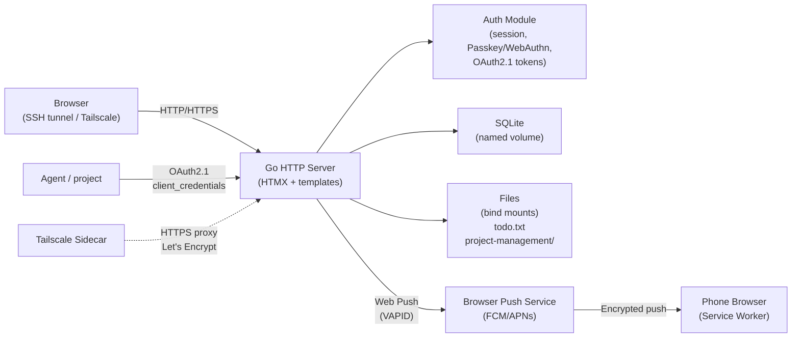

# Dashboard

- **Code:** DSH
- **Status:** Review complete (Iteration 029) — Tailscale phone passkey enrollment fix shipped
- **Priority:** Q2 — Important, Not Urgent
- **Lead:** Developer
- **Created:** 2026-05-27
- **Last updated:** 2026-06-15
- **Current phase started:** 2026-06-15

## Overview
A self-hosted web dashboard that aggregates idea backlog, project management progress, and agent outputs into a single UI — accessible from any machine Tomas uses via SSH port-forward.

## Architecture

## Current State
Iteration 029 — **Review complete.** Tailscale phone passkey enrollment fix (iteration 028, branch `dsh-taila-fix`) accepted and ready to merge. On-demand device enrollment via **Passkeys → "Add a new device"** (QR + link to Tailscale origin), generation-anchored token TTL, deterministic RP fallback. See [DSH-031], [DSH-032].

Previous — Iteration 026 — **Threads** shipped: durable M:N discussions attachable to notifications/plans/projects; agents post via JWT API with authenticated authorship, Tomas replies in the UI; `[discuss]`/💬 links on notification rows; nav badge counts open threads. This is the re-scoped L32+L33 (ideation 024): herdr/MND own the *live* agent-direction channel, DSH owns the *durable* one. First consumer: GML processed-tracking (`?ref_type=notification&ref_id=N&status=resolved` ⇒ skip re-distilling) — GML-side adoption is a `[GML]` backlog entry. Real-data acceptance test ready, pending a live-DB copy.

Previous: Iteration 022 — todo.txt filters/sort/badges/bulk actions. Iteration 020 — backlog batch (todo delete, project drill-down, favicon, notif display, Compose Watch). Iteration 019 — LLP tab over secure handshake. Iteration 016 — push notifications.
