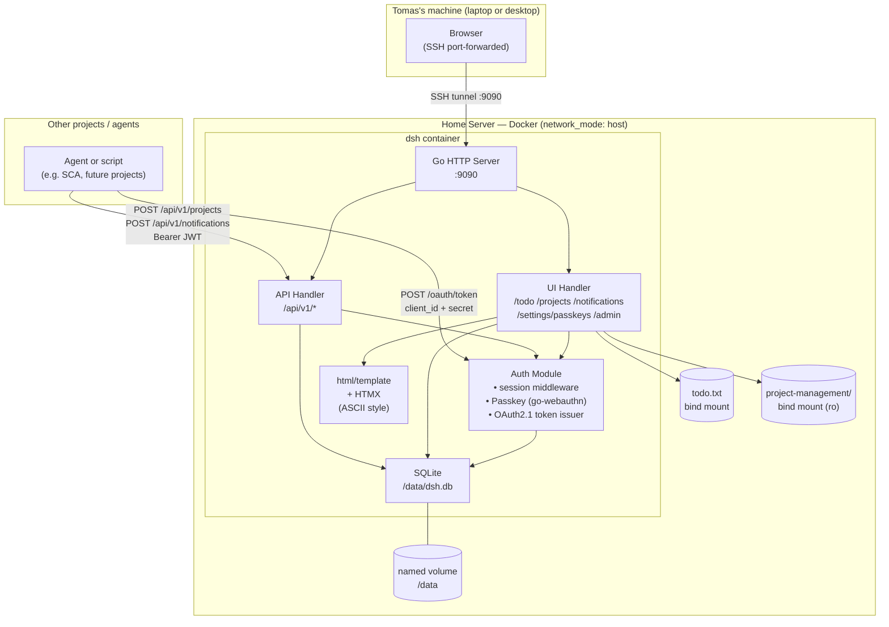
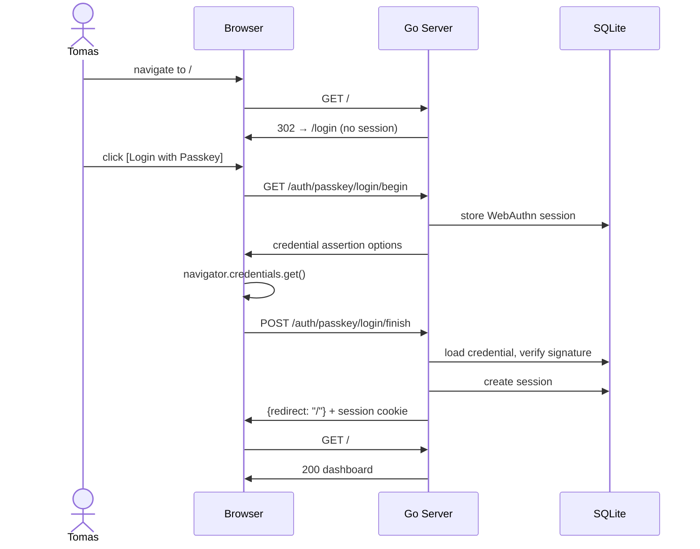
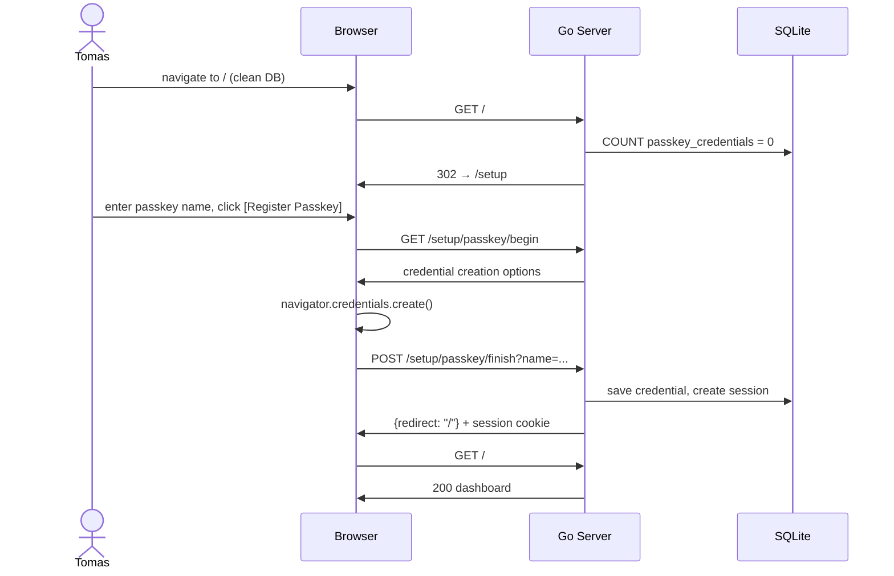
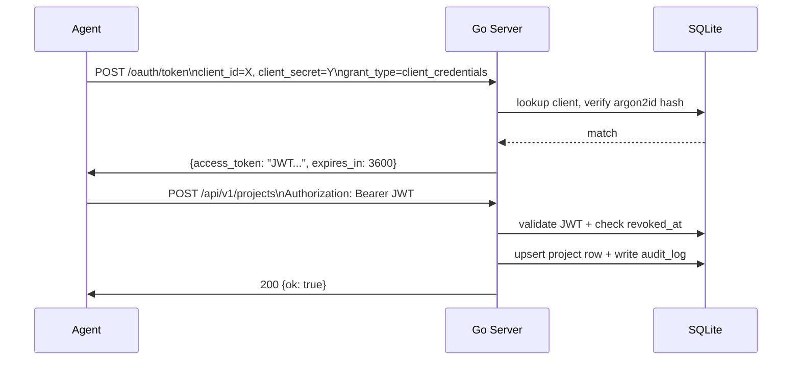

# DSH — Architecture Diagram

## System Overview



## Request Flow — Passkey Login



## Request Flow — First-run Setup



## Request Flow — API Ingest (OAuth 2.1 client credentials)



## Database Schema

```
users
  id            INTEGER PK
  username      TEXT UNIQUE
  password_hash TEXT              -- set at bootstrap, never used for login
  created_at    DATETIME

passkey_credentials
  id            INTEGER PK
  user_id       INTEGER FK→users
  credential_id TEXT UNIQUE
  public_key    BLOB
  sign_count    INTEGER
  flags         INTEGER           -- CredentialFlags byte (BackupEligible etc.)
  name          TEXT              -- user-given name, e.g. "MacBook Touch ID"
  created_at    DATETIME

webauthn_sessions
  id            TEXT PK           -- "login_anon" or "reg_<userID>"
  user_id       INTEGER           -- NULL for login ceremony
  data          TEXT              -- JSON-serialised webauthn.SessionData
  expires_at    DATETIME          -- 5-minute TTL

sessions
  id            TEXT PK           -- random 32-byte hex token
  user_id       INTEGER FK→users
  data          TEXT              -- JSON: {csrf_token}
  created_at    DATETIME
  expires_at    DATETIME          -- 24-hour TTL

oauth2_clients
  client_id         TEXT PK
  client_secret_hash TEXT         -- argon2id
  name              TEXT
  created_at        DATETIME
  revoked_at        DATETIME      -- NULL = active
  last_used_at      DATETIME
  last_used_ip      TEXT

notifications
  id            INTEGER PK
  project_code  TEXT
  message       TEXT
  type          TEXT              -- action_needed/info
  created_at    DATETIME
  dismissed_at  DATETIME          -- NULL = active

audit_log
  id            INTEGER PK
  event         TEXT              -- login_success, passkey_login_failure, api_call, ...
  actor         TEXT              -- username or client_id
  remote_ip     TEXT
  detail        TEXT
  created_at    DATETIME

config
  key           TEXT PK           -- e.g. jwt_secret
  value         TEXT

schema_migrations
  name          TEXT PK           -- migration filename
  applied_at    DATETIME
```

## File-backed Data (bind mounts)

| Mount | Container path | Access | Content |
|---|---|---|---|
| `../../todo.txt` | `/todo.txt` | rw | Todo items — `- [s] text  #Q2 #date` format |
| `../../project-management` | `/pm` | ro | `*/PROJECT.md` files — parsed by pmreader |

## Environment Variables

| Variable | Required | Default | Description |
|---|---|---|---|
| `DSH_PORT` | no | `8080` | HTTP listen port |
| `DSH_DB_PATH` | no | `/data/dsh.db` | SQLite file path |
| `DSH_ORIGIN` | yes | — | WebAuthn RP origin, e.g. `http://localhost:9090` |
| `DSH_PM_PATH` | no | — | Path to project-management directory (bind mount) |
| `DSH_TODO_PATH` | no | — | Path to todo.txt file (bind mount) |

## Project Layout

```
projects/DSH-dashboard/
├── Dockerfile
├── docker-compose.yml
├── backup.sh / restore.sh
├── run.sh
├── go.mod / go.sum
├── cmd/dsh/
│   ├── main.go                   -- config, DB init, route registration
│   └── web/
│       ├── templates/            -- Go html/template files (embedded)
│       └── static/               -- style.css + htmx.min.js (embedded)
└── internal/
    ├── auth/                     -- session, passkey/WebAuthn, OAuth2 token issuer, audit
    ├── config/                   -- env var loading
    ├── db/                       -- SQLite connection, migration runner
    │   └── migrations/           -- 001_init.sql … 005_passkey_name.sql
    ├── handler/                  -- HTTP handlers: auth, ui, api, middleware
    ├── model/                    -- shared data types
    ├── pmreader/                 -- PROJECT.md filesystem reader
    └── todoreader/               -- todo.txt file reader/writer
```
