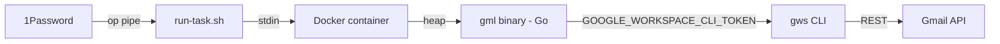

# GML — Gmail Agent

- **Code:** GML
- **Status:** Implementation (Iteration 023) — distilled-ledger processed-tracking (off DSH threads)
- **Priority:** Q2
- **Lead:** Developer
- **Created:** 2026-05-27
- **Last updated:** 2026-06-14
- **Current phase started:** 2026-06-14

## Overview
An agent that connects to Gmail via `gws` (Google Workspace CLI), produces inbox statistics, archives messages according to configurable rules, and provides AI-powered inbox analysis — reducing manual inbox maintenance overhead and surfacing insights via the DSH dashboard.

## Modes
1. **Rule Engine** (Mode 1) — DONE. Config-driven archive rules, stats, scheduler daemon.
2. **AI Analysis** (Mode 2) — DONE. Dual-LLM (Gemini default + Claude) email analysis with prompt injection protection, Eisenhower priority, insights pushed to DSH.
3. **Behavioral Learning & Rule Proposals** (Mode 3) — IN PROGRESS (Iteration 010). Two stages: (A) extract behavior patterns from DSH comments + Gmail thread signals, (B) propose rules. Approval via DSH notifications.

## Architecture (Mode 1 — current)

## Current State
Mode 1, Mode 2, and Mode 3A complete, live-tested, and reviewed. Iteration 014 added execution visibility and logging. Iteration 015 adds `gml propose` — the first step of the plan-and-approve workflow (Mode 3B).
- `gml propose` → `gml post-plan` → DSH /plans UI → `gml apply-rules` → rules.yaml (full plan-and-approve pipeline)
- DSH /plans page with pending/approved/rejected tabs, constraint warnings, approve/reject per proposal
- `gml run --dry-run --json` outputs structured JSON with reason for each rule match
- Enhanced text output shows date and human-readable reason per action
- Unified scheduler logging with reason context
- Three-step pipeline: container fetch/sanitize → host LLM (Gemini default, Claude optional) → container validate/notify
- Per-concern notifications with Eisenhower priority (🔴Q1 🟡Q2 🔵Q3 ⚪Q4) and Gmail search links
- 5-layer prompt injection defense (datamarking, XML structure, sanitization, output validation, architectural constraint)
- `./watch.sh` unified daemon manager: start/stop/restart/status/logs/attach for all 3 daemons with `--interval N` CLI control and persistent logging to `~/.local/share/gml/`
- `./run-task.sh` single-task runner: analyze, learn, distill, propose, apply-rules, run, watch-*, profile, stats
- All daemon intervals default to 5 minutes, overridable via `--interval N`
- Non-root container (gml user)
- Dedup filter: prompt skips unchanged concerns + code drops "Unchanged:" summaries
- 196 tests across the Go module (sanitization, notify, propose, rules, prompt, knowledge, behavior, gmail, cmd/gml, …)

### Recent iterations
- **018 — dedup hardening:** `CanonicalQuery` Gmail-query normalizer (key-only), durable
  insight-dismissal dedup, DSH notification limit clamp, LLM semantic propose gate.
- **019 — one rule per sender:** fold overlapping same-sender candidates at propose into a single
  rule; deterministic `SameSenderConflicts`/`GuardSameSender` backstop withholds the OR-union
  footgun from rules.yaml; deterministic apply wired as `watch-knowledge` step 4/4; `rules` daemon
  hot-reloads rules.yaml.
- **020 — insight provenance:** `source_insights` back-tracking threaded insight→knowledge→plan→
  rule (deterministic Link↔gmail_search join) + todo back-link suffix; distill skip-dedup and
  plan dedup keyed on provenance. Forward-only.
- **021 — insight dedup:** identity key (`gmail_search` `from:`-tokens + category) collapses the
  same insight reworded each cycle. Active match → update in place (`PATCH /api/v1/notifications/{id}`,
  guarded `dismissed_at IS NULL`); dismissed match → re-surface only if genuinely new via
  `insight-dedup` LLM stage (learn path mirrors analyze); structural floor stays. Symmetric key
  derivation (both sides parse `from:`-tokens); `learn` grouping discipline keeps one insight per
  behavior.
- **022 — threads processed-tracking:** distill skip-check is now provenance (iter 020) ∪ a
  resolved DSH thread on the insight; distill-apply posts a resolved thread for the residual gap
  provenance can't reach (todo-only / distilled-to-nothing / non-matching-query), so those are
  never re-fed to the LLM. Forward-only marking of the gap set only (bounds web-push); best-effort,
  never fatal. New `ListResolvedNotificationThreads` + `PostResolvedThread` DSH-client methods.
  Adopts the DSH Threads contract (DSH iter 026); closes todo L75. **Superseded by 023.**
- **023 — distilled-ledger (off threads):** review found no LLM/agent reads DSH threads and the
  discussion feature is unused, so the iter-022 markers were a flag wearing a thread costume.
  Moved processed-state to a local append-only ledger `distilled_insights` in `knowledge.yaml`;
  skip-set = provenance ∪ ledger; `distill-apply` records the residual gap there. Removed the
  thread DSH-client methods. No DSH calls in the skip/record path (faster, no web-push, no UI
  clutter). Real-data verified against a live-DB copy. See ASSUMPTIONS GML-087.

## 1Password Items
- **"GML Gmail Agent"** (Login) — OAuth client_id (username) + client_secret (password)
- **"GML Gmail Read-Only Credentials"** (Password) — read-only token JSON (credential field)
- **"GML Gmail Read-Write Credentials"** (Password) — modify-scoped token JSON (credential field)
