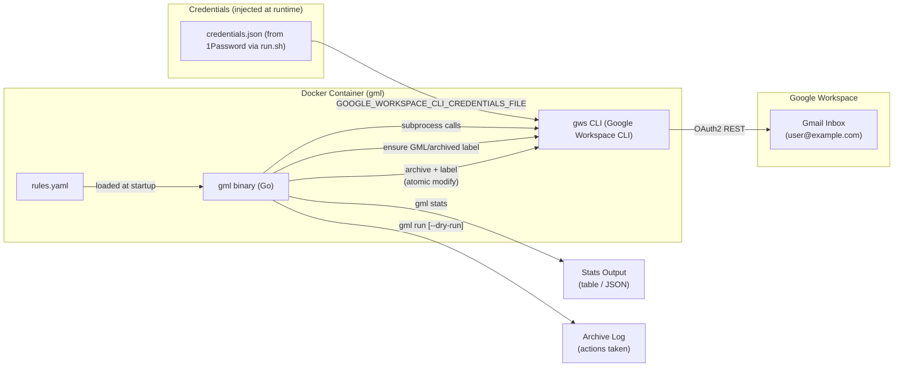
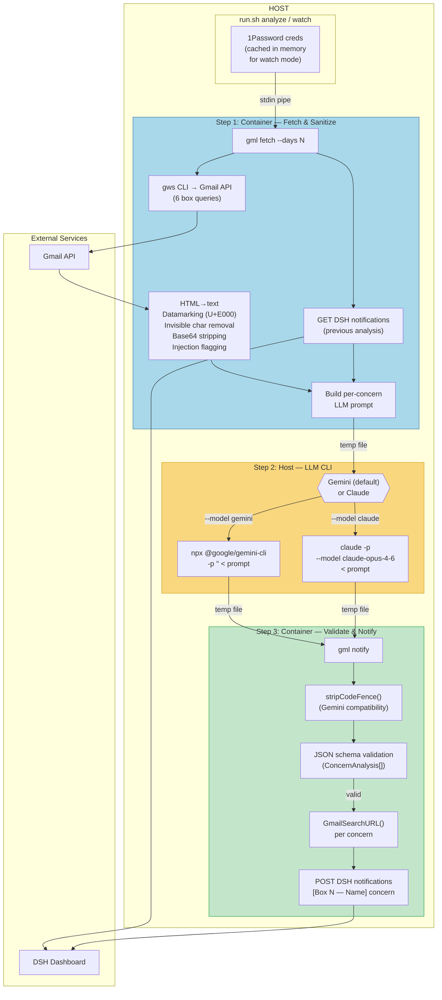
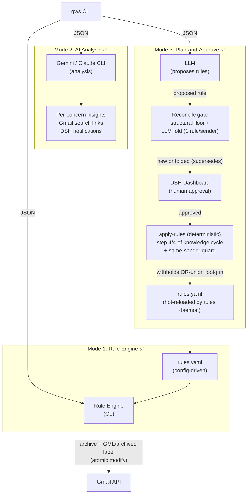

# GML Architecture

## Mode 1: Rule Engine



## Mode 2: AI Analysis Pipeline



### Data Flow

| Step | Where | Input | Output |
|------|-------|-------|--------|
| Fetch | Container | Gmail creds (stdin), DSH JWT | Complete LLM prompt (temp file) |
| Analyze | Host | Prompt (temp file) | Per-concern JSON (temp file) |
| Notify | Container | LLM JSON (stdin), DSH JWT | Per-concern notifications posted to DSH |

### Prompt Injection Defense (5 layers)

```
Email content (untrusted)
  │
  ├─ Layer 1: Datamarking ──── U+E000 between every word (drops attack <3%)
  ├─ Layer 2: Prompt structure ── XML delimiters, "RAW DATA" framing
  ├─ Layer 3: Input sanitization ── HTML strip, base64 remove, invisible chars
  ├─ Layer 4: Output validation ── Strict JSON schema, enum types
  └─ Layer 5: Architecture ──── No tool access, advisory only, fresh process
```

### Watch Daemon

```
./run.sh watch [--model gemini|claude]
  │
  ├─ Fetch 1Password credentials (once, cached in GML_CACHED_CREDS)
  │
  └─ Loop every N minutes (analysis.schedule_minutes, default 360):
       ├─ run_analyze() — full 3-step pipeline
       ├─ Log success/failure
       └─ sleep Nm
```

## Full Vision (all 3 modes)



**Mode 3 knowledge cycle (per interval):** `learn → distill → propose (folds, 1 rule/sender) →
apply-rules (deterministic, same-sender guard)`. The merge/conflict LLM is retired from the cycle
(manual `apply-rules --model` diagnostic only); conflict *prevention* now lives in the reconcile
gate, with a deterministic guard as the backstop. See ASSUMPTIONS GML-063/064/065.

**Insight provenance (back-tracking, iteration 020).** Each artifact records `source_insights`
(DSH notification #IDs), threaded deterministically — the distill prompt makes
`pattern.gmail_search == insight.Link`, so the join attributes insight→pattern with no LLM, then
field-copy carries it pattern→proposal→rule; todos get a `(insight #N)` back-link from LLM
attribution.

```
insight #ID ──(dismiss+comment)──▶ distill ──[Link≡gmail_search join]──▶ knowledge.source_insights
     │                                                                          │ Generate (copy)
     │                                                                          ▼
     └─(LLM-attributed)──▶ todo "(insight #N)"                         plan.source_insights
                                                                                │ apply (copy)
                                                                                ▼
                                                                       rule "# insights #N"
```
Dedup off this: `distill-gather` skips insights already in a pattern's `source_insights`;
`structuralDedup` skips candidates whose source-insight set a live plan already covers. Forward-
only. See ASSUMPTIONS GML-066.

**Insight dedup (iteration 021).** The `learn` LLM re-derives the same insight each cycle with a
different `gmail_search` string, which the structural key can't collapse. Insights are deduped by an
**identity key** = the query's `from:`-tokens + category (NOT the volatile full query). The learn
path now mirrors the analyze path's dedup stage, and the shared poster classifies deterministically:

```
learn ─▶ gemini ─▶ insight-dedup (LLM, vs DISMISSED) ─▶ insights = ClassifyInsights (vs ACTIVE)
                   │  reworded dup → drop                │  identity match (active) → PATCH update
                   │  genuinely new → keep "Update:"     │  exact-query repost   → skip (floor)
                   ▼                                      ▼  else                  → post new
              (2b re-surface)                       (2a update in place)
```
Identity is derived symmetrically — both the stored row and the candidate parse `from:`-tokens from
their notification — so a candidate's key is the key it will have once stored; a `from:`-less insight
falls back to the structural floor. `PATCH /api/v1/notifications/{id}` is guarded `dismissed_at IS
NULL`, so an update never resurrects a dismissed insight. See ASSUMPTIONS GML-068.
