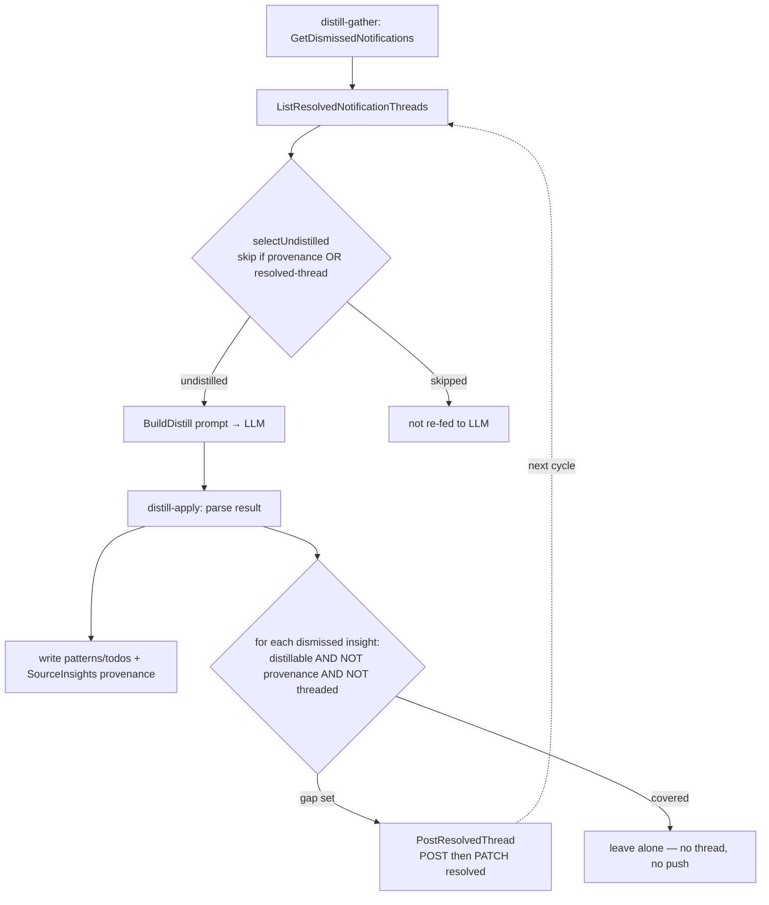

# GML — Iteration 022: Planning — Adopt DSH Threads processed-tracking in distill

- **Phase:** 1 — Planning
- **Phase lead:** Developer
- **Start:** 2026-06-13
- **Input:** `022-ideation.md` (re-scope: close the *residual* distill gap provenance can't reach; keep provenance for the common case + traceability)

---

## Approach (from ideation, Option D)

Skip = **provenance ∪ resolved-thread**; mark **forward-only**, gap set only.
Two surgical insertions in the distill path + two new DSH-client methods. No new
auth (reuse the existing OAuth Bearer flow), no DSH-side change. Analyze-side
dedup untouched.

## Test requirements (TDD — written FIRST; these define "done")

**DSH client — `internal/notify/dsh_test.go`** (httptest pattern already in file):

1. **`ListResolvedNotificationThreads`** — server returns a thread list; method
   issues `GET /api/v1/threads?ref_type=notification&status=resolved`, parses
   string `ref_id`s into an `int64` set; tolerates empty list; non-200 → error.
2. **`PostResolvedThread`** — asserts the **two-call sequence**: `POST
   /api/v1/threads` body `{subject, body, ref_type:"notification", ref_id:"N"}`
   → uses `id` from `{ok,id}` response → `PATCH /api/v1/threads/{id}`
   `{status:"resolved"}`; an error in either call propagates.

**Selection logic — `internal/notify/provenance_test.go` (or `cmd/gml/main_test.go`):**

3. **Skip union** — `selectUndistilled` skips an insight covered by a resolved
   thread even when provenance does *not* cover it (gap case); still skips
   provenance-covered ones.
4. **Gap-marking selection** = exactly `distillable ∧ ¬provenance ∧ ¬threaded`:
   - todo-only insight (no pattern) → marked;
   - distills-to-nothing insight → marked (runs even on empty LLM result);
   - provenance-covered insight → **not** marked (no thread, no push);
   - already-resolved-threaded insight → not re-marked.

**Regression:** full `go test ./...` green; analyze-side dedup tests untouched.

## Plan / checklist

1. **`internal/notify/dsh.go`** — add (mirroring existing Bearer methods):
   - `ListResolvedNotificationThreads() (map[int64]bool, error)` — one batched
     `GET …?ref_type=notification&status=resolved` (DSH applies filters
     independently, `api_threads.go:159-181`); parse string `ref_id` → int64.
   - `PostResolvedThread(refID int64, subject, body string) error` — `POST` then
     `PATCH …{status:"resolved"}`. Stringify `refID`; subject ≤200, body ≤10000.
   - request/response structs (`threadListRow{id,ref_id,…}`, `createThreadResp{ok,id}`).
2. **`cmd/gml/main.go` — `cmdDistillGather` / `selectUndistilled`:**
   - fetch `resolved` set once (best-effort: on error, log + fall back to
     provenance-only = today's behaviour);
   - `selectUndistilled(dismissed, kf, resolved)` skips if
     `distilled[n.ID] || resolved[n.ID]`.
3. **`cmd/gml/main.go` — `cmdDistillApply`:** after a successful parse (incl.
   empty result), build the provenance `distilled` set + fetch `resolved`, then
   for each dismissed insight that is `distillable ∧ ¬distilled ∧ ¬resolved` →
   `PostResolvedThread`. Best-effort (warn, never `os.Exit`).
4. **Shared predicate** — factor `isDistillable(n)` (`[Insight:`-tagged ∨
   `Comment != ""`) into one helper used by both `selectUndistilled` and the
   apply marking step.
5. Tests 1–4 alongside (TDD).
6. `go test ./... && go vet ./internal/... ./cmd/...`; real-data acceptance (below).
7. Docs: `ASSUMPTIONS.md` (GML-084/085/086), `README.md` note, close todo L75.

## Flow

## Decisions (→ `ASSUMPTIONS.md`)

- **GML-084 — Threads close the *residual* distill gap; provenance retained for
  traceability + fast-path, not removed.** Provenance (GML-020) only marks
  insights that produced a matching pattern; todo-only / distills-to-nothing /
  non-matching-query insights are re-fed forever. A resolved thread keyed on the
  immutable notification ID covers all of them. *Tension with GML-020 "no separate
  ledger to drift":* accepted — the thread key is the immutable DSH notification
  ID (cannot drift like a derived query key), is the shipped + acceptance-tested
  cross-service contract, and is the only option giving Tomas DSH-side visibility.
  Skip = `provenance ∪ resolved-thread`.
- **GML-085 — Forward-only marking of the gap set only (exclude provenance-covered)
  to bound web-push volume.** `CreateThread` web-pushes Tomas on every creation
  (`api_threads.go:152`); marking only `distillable ∧ ¬provenance ∧ ¬threaded`
  makes the burst one-time and proportional to the current uncovered backlog,
  zero for the common case. Consistent with GML-020's forward-only precedent.
- **GML-086 — Thread marking is best-effort, never fatal to distill.** A
  bookkeeping side-effect must not break the primary distill output; failure
  degrades gracefully to today's reprocessing behaviour.

## Verification (MO §1 — run it or it doesn't count)

1. **Unit:** `cd projects/GML-gmail-agent && go test ./... && go vet ./...`.
2. **Real-data acceptance (mirrors DSH iter-026):** against a **copy** of the live
   `dsh.db` (Tomas produces via `sqlite3 .backup`, live DB untouched) with a real
   OAuth2 token — pick a real dismissed insight that is a **true gap case** (no
   matching pattern: todo-only or distills-to-nothing):
   - run `gml distill-gather | <llm> | gml distill-apply`;
   - assert a resolved thread now exists (`GET …&ref_id=N&status=resolved`
     non-empty), `created_by` = GML's OAuth client name;
   - re-run gather → insight is skipped (`N already distilled`);
   - assert a provenance-covered insight did **not** get a thread (no push spam).
3. **Live smoke:** one `watch-knowledge` cycle — confirm the "skipped as already
   distilled" count rises and the gap insights are no longer in the LLM prompt
   (compare prompt size cycle-over-cycle).

## Files

- `projects/GML-gmail-agent/internal/notify/dsh.go` (+ `dsh_test.go`) — 2 methods, structs, tests 1–2.
- `projects/GML-gmail-agent/cmd/gml/main.go` — `cmdDistillGather`, `selectUndistilled`, `cmdDistillApply`, `isDistillable` helper.
- `projects/GML-gmail-agent/internal/notify/provenance_test.go` (or `cmd/gml/main_test.go`) — tests 3–4.
- `project-management/GML-gmail-agent/ASSUMPTIONS.md` — GML-084/085/086.
- `projects/GML-gmail-agent/README.md`; `todo.txt` (close L75 on merge).

## Out of scope

See `022-ideation.md` § Scope — analyze-side dedup, removing provenance, DSH-side
changes, LLM cross-linking / per-agent inbox.
