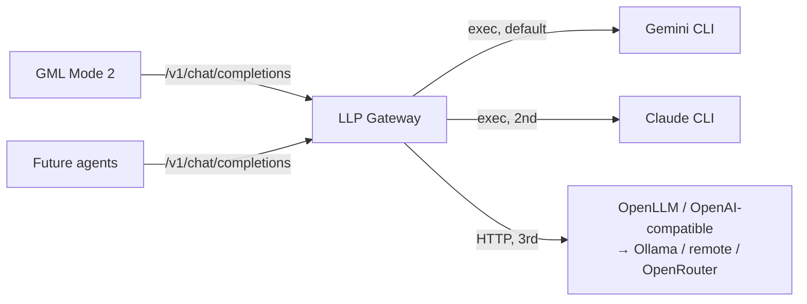

# LLP — LLM Proxy (Gateway)

- **Code:** LLP
- **Status:** Reviewed (Iteration 010) — iterations 008–009 accepted by Tomas 2026-06-15; parked pending next work item
- **Priority:** Q2 (Important, Not Urgent) — force-multiplier infrastructure for every agent
- **Lead:** Developer
- **Created:** 2026-06-12
- **Last updated:** 2026-06-15
- **Current phase started:** 2026-06-12

## Overview
A self-hosted gateway that puts **one OpenAI-compatible API** (`POST /v1/chat/completions`) in front of several swappable LLM backends. The façade is the interface; under it sit impls used in failover order — **① Gemini CLI (default) → ② Claude CLI → ③ OpenLLM / OpenAI-compatible HTTP** (Ollama, remote API, or OpenRouter). It queues and rate-limits to avoid quota exhaustion, fails over automatically, and tracks usage/cost. GML Mode 2 is the first migration customer: instead of `run-task.sh` invoking the CLIs directly, GML calls the proxy.

## Architecture

(Full diagram: `diagrams/architecture.md`)

## Current State
Phases 0–2 complete (`ASSUMPTIONS.md` LLP-001..009). v1 implemented in `projects/LLP-llm-proxy/`:
OpenAI façade, CLI (gemini/claude) + HTTP (openllm, stubbed) providers, failover router with
per-impl queue + cooldown, SQLite usage/cost, bearer auth, host `run.sh`. **40 tests pass (race-clean).**
Live acceptance: **L1** gemini serves · **L2** forced failover → claude + cooldown · **L3** GML's
`llp_complete` → proxy → valid concern JSON. **Iteration 004** added OpenRouter-style model selection
(`auto` / `gemini` / `gemini/gemini-2.5-pro`), live-verified across all forms; fixed a rate-limit
misclassification (stack-trace `googleQuotaErrors.js` matched bare "quota"). **46 tests pass.**
Logs: `iterations/003-implementation.md`, `iterations/004-model-selection.md`.
**Iteration 008** (todo-70): gemini impl hardened with `--approval-mode default` + committed
`.gemini/settings.json` (LLP-014, Q1 — headless gemini could write files via inherited
`auto_edit`); gemini-cli's internal 10-attempt retry disabled and quota-exhausted errors
(`TerminalQuotaError`, "usage limit reached") now classified onto a longer `quota_cooldown`
(LLP-015 — root cause of the 2–3 min request burns); `/healthz` reflects serveability
(per-impl `serveable`/failure signals, top-level `degraded`; LLP-016); startup guard refuses a
gemini-cli command without an explicit `--approval-mode` in both `run.sh` and `registry.Build`
(LLP-017). **60 tests pass (race-clean)**, verified live on side instances; the Q1 fix is **live
on :4000** (restart 2026-06-13 00:09, Tomas-approved, runtime-verified via live child argv).
Log: `iterations/008-security-quota-healthz.md`.
**Iteration 009** (on master per Tomas's ruling): `stream: true` honored — façade-level SSE
(`chat.completion.chunk` events, usage in the final chunk, `[DONE]`; LLP-018); failover/queue/
usage identical to the non-streaming path; works for all impls incl. openllm (enabling it stays
config-only, LLP-007). **63 tests pass (race-clean)**, live-verified via real gemini (`curl -N`).
Log: `iterations/009-streaming.md`. **Reviewed and accepted by Tomas 2026-06-15** (`iterations/010-review.md`).
Possible next: wire OpenLLM live (config), true pass-through streaming (LLP-018 revisit), DSH usage view.
