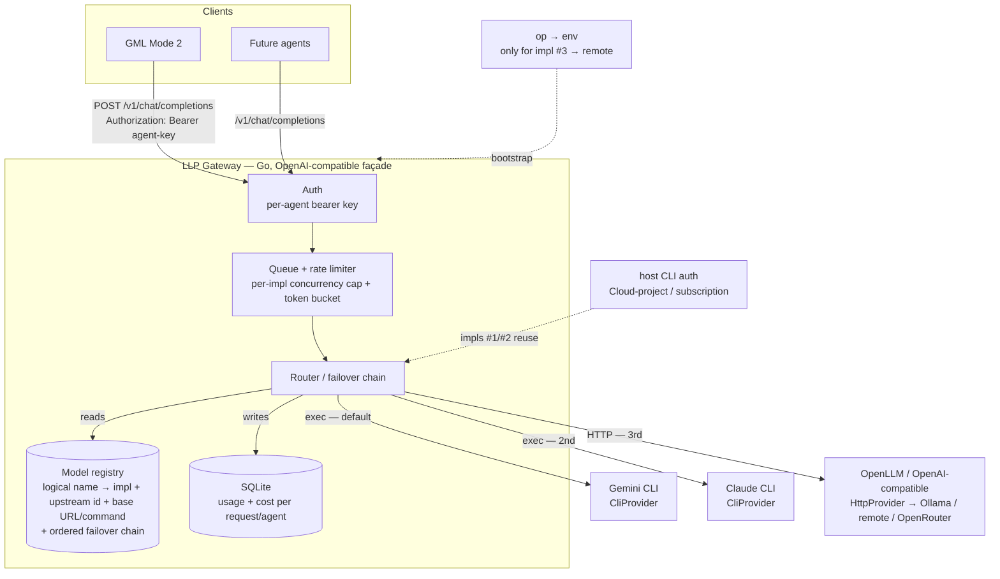

# LLP — Architecture (Ideation sketch)

Exploratory; refined in Phase 1 planning.

## Request flow



## Failover sequence

```mermaid
sequenceDiagram
    participant C as Client (GML)
    participant P as LLP Router
    participant G as Gemini CLI
    participant A as Claude CLI

    C->>P: POST /v1/chat/completions (model: gml-analyze)
    P->>G: exec gemini-cli (default, primary in chain)
    G-->>P: rate-limited / non-zero exit (retryable)
    Note over P: terminal error (bad request) would stop here;<br/>rate-limit / exit / timeout → fail over
    P->>A: exec claude -p (next in chain)
    A-->>P: stdout: completion (+ token usage)
    P->>P: record usage/cost (impl_used = claude-cli)
    P-->>C: 200 OpenAI-shaped response
```
