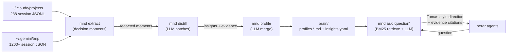

# MND — Mind Model

- **Code:** MND
- **Status:** Iteration 8 merged — fidelity eval live (59% in-sample; confidence non-discriminating; decision_heuristic 38% vs tech_preference 80%). Next (iter 9): close the tech-vs-judgment gap.
- **Priority:** Q2
- **Lead:** Developer
- **Created:** 2026-06-12
- **Last updated:** 2026-06-14
- **Current phase started:** 2026-06-14

## Overview
Distills Tomas's decision-making "brain" from his Claude + Gemini session history into readable Markdown profiles and an evidence base, then exposes it through an orchestrator command (`mnd ask`) that answers agent questions — directions, priorities, corrections — the way Tomas would. End goal: herdr agents get Tomas-style steering without interrupting Tomas.

## Architecture

## Current State
Iteration 1 **accepted by Tomas** (2026-06-12, see iterations/004-review.md): full corpus distilled (787 insights from 1853 moments), profiles v2, live herdr orchestration loop proven (`orchestrate.sh` — agent asked, brain answered as Tomas, agent proceeded).

Iterations 2 (self-excluding retraining) and 3 (DSH low-confidence feedback loop) **accepted and merged** (2026-06-12, iterations/007/010-review.md). The full loop is live: escalation → Tomas's dismissal comment → corrective insight → corrected answers.

Iteration 4 in progress (iterations/011-ideation.md, Tomas's go 2026-06-12): (A) route LLM calls through the **LLP gateway** when up — highest models on both sides (`gemini-3-pro-preview` → `claude-fable-5`), quota-aware via LLP's cooldown/failover, direct-CLI fallback when LLP is down; (B) **watch mode** — poll `herdr agent list`, auto-answer `blocked`/`idle` agents with loop protection (answer-once, repeat ⇒ DSH escalation), `pending: none` gate for agents that ask nothing. Iteration 5 carry-over: contradiction resolution.
