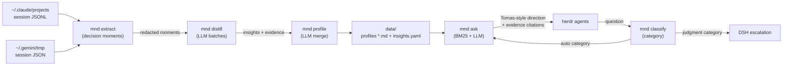

# MND — Mind Model

- **Code:** MND
- **Status:** Iteration 11 in progress — embedding-based retrieval + evidence gate. Ollama GPU + nomic-embed-text (768-dim). 91% fidelity at 57% coverage with tech_preference in auto-set. Replaces broken LLM classifier.
- **Priority:** Q2
- **Lead:** Developer
- **Created:** 2026-06-12
- **Last updated:** 2026-06-16
- **Current phase started:** 2026-06-15

## Overview
Distills Tomas's decision-making "brain" from his Claude + Gemini session history into readable Markdown profiles and an evidence base, then exposes it through an orchestrator command (`mnd ask`) that answers agent questions — directions, priorities, corrections — the way Tomas would. End goal: herdr agents get Tomas-style steering without interrupting Tomas.

## Architecture

## Current State

**Merged to master (iterations 1–8):**
- Iter 1: full corpus distilled (787 insights / 1853 moments), profiles v2, live herdr orchestration loop
- Iter 2: self-excluding retraining (turn-level discrimination, datamark, phrase markers)
- Iter 3: DSH low-confidence feedback loop (escalation → comment → corrective insight)
- Iter 4: LLP gateway routing + watch mode (auto-answer blocked/idle agents, loop protection)
- Iter 5: contradiction resolution (three-way verdict), attribution prefix `[MND orchestrator]`
- Iter 6–7: loop-until-dry contradiction sweep, eval-brain deferred, retrain daemon fixes
- Iter 8: fidelity eval (`mnd eval`) — 59% in-sample, confidence non-discriminating (100% high while 41% wrong), tech_preference 80% vs decision_heuristic 38%

**On branch, pending review (iterations 9–10):**
- Iter 9: three attacks on the tech-vs-judgment gap all **failed** (ask-side prompt, computed confidence from retrieval, semantic dedup). Conclusion: the split is a structural ceiling. Shipped: `eval-rerun` A/B tool, `eval-calibration`, `mnd dedup`. Reverted all fidelity attempts.
- Iter 10: **competence-boundary routing** — classify incoming question by category (cheap LLM), auto-answer where measured-safe, escalate the rest. Replaces the broken confidence gate. Default policy: `correction_pattern,direction_pattern` → 78% delivered fidelity at 42% coverage, 0 judgment leaks. `MND_ROUTE=off` for legacy. Policy knob awaiting Tomas's call.

**Deferred:** held-out eval-brain validation (MND-031).
