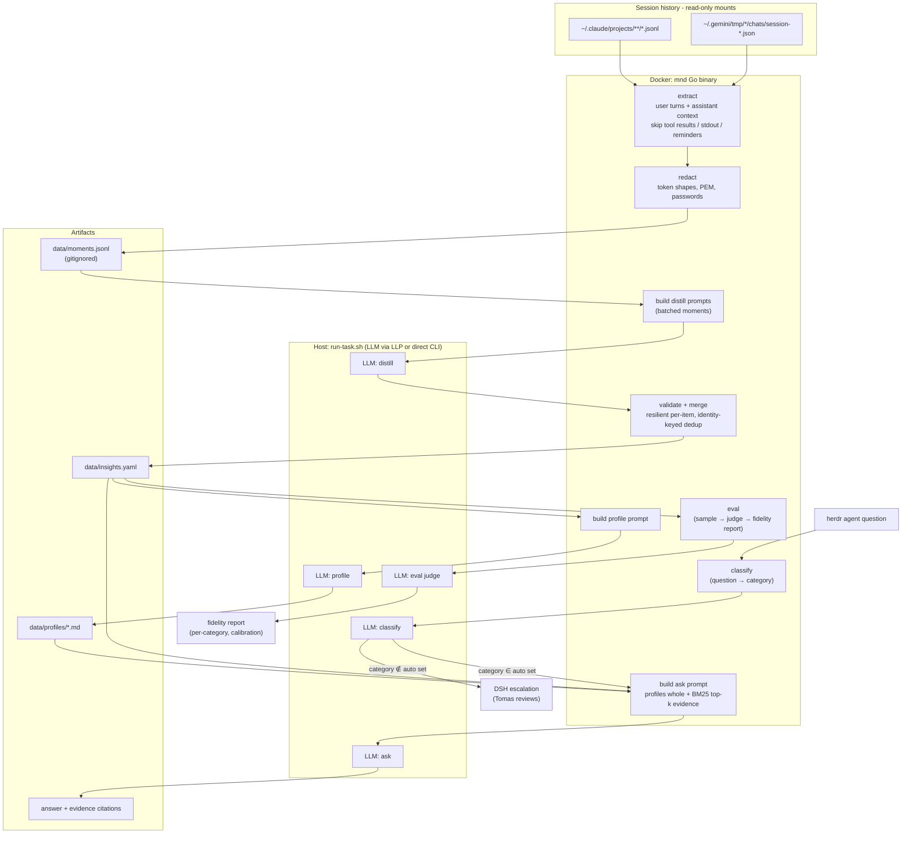
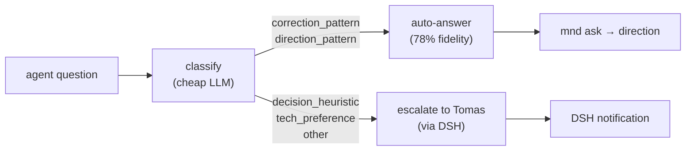

# MND — Architecture

## Pipeline

## Competence gate (iteration 10)

Routing keys on the **predicted question category**, not self-reported confidence (which is non-discriminating). The routing signal is validated externally via the eval judge. `MND_ROUTE_AUTO` tunes the auto set; `MND_ROUTE=off` disables.

## Data flow contract

| Stage | In | Out | LLM |
|---|---|---|---|
| extract | session files (ro) | `data/moments.jsonl` — `{source, project, session, ts, context, text}` | no |
| distill | moments.jsonl | `data/insights.yaml` — `{id, category, statement, confidence, evidence[]}` | yes, batched |
| profile | insights.yaml | `brain/profiles/{decision-making,technical-preferences,direction-style}.md` | yes |
| ask | question + data/ | direction + citations (text or JSON) | yes |
| classify | question text | category label (one of 4 + `other`) | yes, single call |
| eval | data/ + sampled moments | fidelity report (per-category %, calibration, disagreement list) | yes, N+1 calls |

## Categories (distill output → routing input)

| Category | Gold fidelity | Predicted fidelity | Route default |
|---|---|---|---|
| `correction_pattern` | 67% | **86%** | ✅ auto |
| `direction_pattern` | 57% | 64% | ✅ auto |
| `tech_preference` | 80% | 50% | ❌ escalate |
| `decision_heuristic` | 38% | 42% | ❌ escalate |
| `other` | — | 50% | ❌ escalate |

Gold ≠ predicted: the classifier is 49% accurate but the *predicted* buckets it gets right are reliably high-fidelity. Tech is best by gold but unreliable by predicted (over-assigned).
