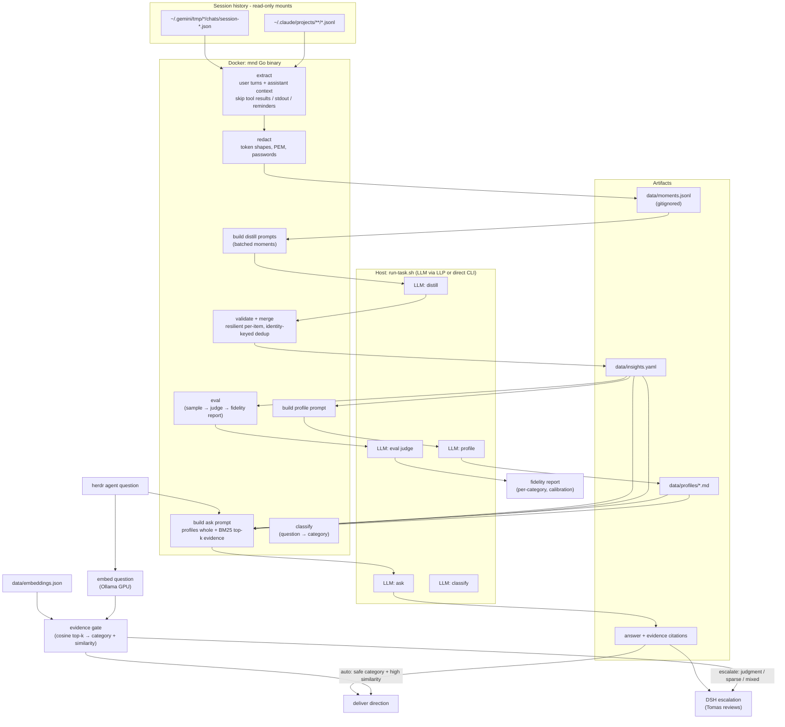
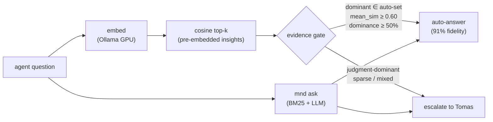

# MND — Architecture

## Pipeline

## Evidence gate (iteration 11)

Routing keys on **what the brain actually found** (embedding retrieval evidence), not a standalone LLM classifier or self-reported confidence. The embedding call is local (Ollama + nomic-embed-text on GTX 1080 GPU) — no LLM call for routing. `MND_ROUTE_AUTO` tunes the auto set; `MND_ROUTE=off` disables.

## Data flow contract

| Stage | In | Out | LLM |
|---|---|---|---|
| extract | session files (ro) | `data/moments.jsonl` — `{source, project, session, ts, context, text}` | no |
| distill | moments.jsonl | `data/insights.yaml` — `{id, category, statement, confidence, evidence[]}` | yes, batched |
| profile | insights.yaml | `brain/profiles/{decision-making,technical-preferences,direction-style}.md` | yes |
| ask | question + data/ | direction + citations (text or JSON) | yes |
| embed-batch | insights.yaml | `data/embeddings.json` (768-dim vectors per insight) | no (Ollama local GPU) |
| embed-query | question text | 768-dim vector | no (Ollama local GPU) |
| evidence gate | query vector + embeddings + insights | gate decision (auto/escalate) + evidence metadata | no |
| eval | data/ + sampled moments | fidelity report (per-category %, calibration, disagreement list) | yes, N+1 calls |

## Categories (distill output → evidence gate input)

| Category | Fidelity (21 cases) | Embedding dominant% | Route default |
|---|---|---|---|
| `correction_pattern` | 93% | 58–83% when dominant | ✅ auto |
| `direction_pattern` | 100% | 50–92% when dominant | ✅ auto |
| `tech_preference` | — (0 gold in set) | 50–92% when dominant | ✅ auto |
| `decision_heuristic` | 72% | 50–83% when dominant | ❌ escalate |

Routing signal comes from embedding retrieval (dominant category of top-k insights), not an LLM classifier. Tech re-included: adding it raised fidelity 87%→91% with +19% coverage.
