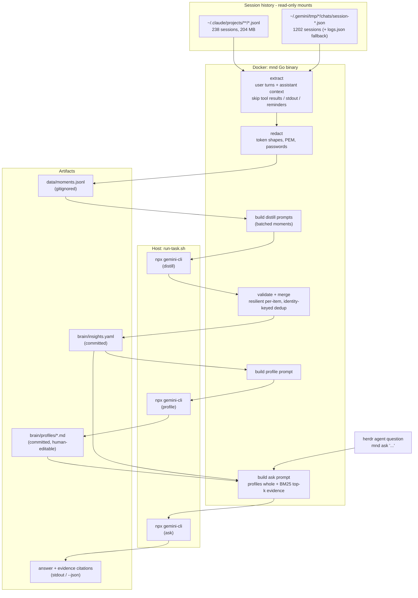

# MND — Architecture

## Pipeline (iteration 1)

## Data flow contract

| Stage | In | Out | LLM |
|---|---|---|---|
| extract | session files (ro) | `data/moments.jsonl` — `{source, project, session, ts, context, text}` | no |
| distill | moments.jsonl | `brain/insights.yaml` — `{id, category, statement, confidence, evidence[]}` | yes, batched |
| profile | insights.yaml | `brain/profiles/{decision-making,technical-preferences,direction-style}.md` | yes |
| ask | question + brain/ | direction + citations (text or JSON) | yes |

## Categories (distill output)

- `tech_preference` — tooling/architecture/security defaults
- `decision_heuristic` — how Tomas weighs options (KISS, good-enough, run-it)
- `direction_pattern` — how he scopes, prioritizes (Eisenhower), delegates
- `correction_pattern` — what he rejects and how he re-steers
