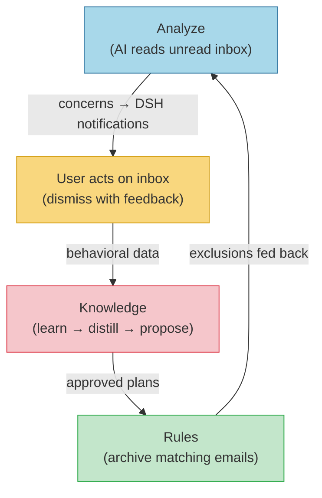

# GML — Gmail Agent

AI-powered email triage with a self-improving rule engine for Gmail.

Credentials flow: 1Password → `op` → pipe → container stdin → Go heap memory.
**Credentials are never written to disk inside the container.**

## The Cycle

GML runs three pipelines that feed into each other:



**Analyze** reads unread emails, sends them to an LLM, and posts actionable concerns to DSH. A dedup step filters out concerns matching previously dismissed notifications before posting. Emails already handled by rules are excluded — analysis focuses on what's left.

**Knowledge** learns from email behavior and DSH feedback, distills patterns into `knowledge.yaml`, and proposes new archive rules for review in DSH.

**Rules** executes approved rules from `data/rules.yaml` — archiving emails by sender, label, age, or content filter. Each rule run narrows what the next analysis sees.

## Commands

### Analyze
```bash
./run-task.sh analyze                     # AI analysis with Gemini (default, one-shot)
./run-task.sh analyze --days 7            # Analyze past 7 days (max 14)
./run-task.sh analyze --hours 4           # Analyze past 4 hours
./run-task.sh analyze --model claude      # Use Claude Opus instead of Gemini
./run-task.sh watch-analysis              # Scheduled analysis daemon
./run-task.sh watch-analysis --model claude
```

Steps: [1/4] fetch emails (excluding rule-matched) → [2/4] LLM analysis → [3/4] LLM dedup review against dismissed notifications (skipped when none exist) → [4/4] validate JSON → post concerns to DSH.

### Knowledge
```bash
./run-task.sh learn                       # Behavioral learning: sender stats → LLM → insights
./run-task.sh learn --days 60             # Analyze past 60 days of behavior
./run-task.sh distill                     # Distill dismissed insights → knowledge.yaml
./run-task.sh propose                     # Propose rules from knowledge.yaml → post to DSH
./run-task.sh propose --json              # Raw JSON output (no DSH posting)
./run-task.sh apply-rules                 # Fetch approved plans from DSH → rules.yaml
./run-task.sh watch-knowledge             # Scheduled learn+distill+propose daemon
./run-task.sh watch-knowledge --model claude
```

Steps: learn patterns → post insights to DSH → user dismisses with comments → distill feedback into knowledge → propose rules for approval.

`distill` will not re-process an insight it has already handled: it skips any dismissed insight covered by knowledge-pattern provenance **or** by the local distilled-ledger, and records the residual cases provenance can't track (todo-only / nothing / non-matching-query) in that ledger. The ledger is `distilled_insights` in `knowledge.yaml` — local, append-only, no DSH dependency in the skip/record path.

### Rules
```bash
./run-task.sh run --dry-run               # Preview what rules would archive (no mutations)
./run-task.sh run --dry-run --json        # Structured JSON output with reasons
./run-task.sh run --since 2               # Only process emails from past 2 hours
./run-task.sh run                         # Apply rules: archive matching messages
./run-task.sh watch-rules                 # Scheduled rules daemon
```

Rule types: `archive_by_sender` (with optional content filter and reply condition), `archive_by_label`, `archive_by_age`.

### Utility
```bash
./run-task.sh profile                     # Verify auth — shows Gmail account
./run-task.sh stats [--json]              # Inbox stats: unread, top senders, age distribution
```

## First-Time Setup

Requires: `op` (1Password CLI, signed in) + `docker`.

### 1. GCP Console setup

1. [Create or select a GCP project](https://console.cloud.google.com/projectcreate)
2. [Enable the Gmail API](https://console.cloud.google.com/apis/library/gmail.googleapis.com)
3. [Configure OAuth branding](https://console.cloud.google.com/auth/branding) → User type: External
4. [Add your email as a test user](https://console.cloud.google.com/auth/audience)
5. [Create OAuth credentials](https://console.cloud.google.com/apis/credentials) → Create credentials → OAuth client ID → Desktop app → Name: **GML Gmail Agent** → Copy Client ID and Client Secret

### 2. Run setup

```bash
./setup.sh
```

Setup will:
1. Build the Docker image
2. Ask for Client ID and Client Secret (or reuse from 1Password on re-run)
3. Save client credentials to 1Password immediately ("GML Gmail Agent" item)
4. Open a browser for Gmail OAuth login (read-only scope)
5. Save tokens to 1Password ("GML Gmail Read-Only Credentials" item)
6. Verify with `./run-task.sh profile`

## 1Password Items

| Item | Type | Scope | Fields |
|------|------|-------|--------|
| GML Gmail Agent | Login | — | `username` = OAuth client_id, `password` = OAuth client_secret |
| GML Gmail Read-Only Credentials | Password | `gmail.readonly` | `credential` = token JSON (refresh_token + metadata) |
| GML Gmail Read-Write Credentials | Password | `gmail.modify` | `credential` = token JSON (refresh_token + metadata) |

Read-only credentials are used by all commands except `run` and `watch-rules`, which use the modify-scoped credentials for archiving. Both credential sets are created during `./setup.sh`.

## Running the Daemons

All three pipelines have a `watch-*` daemon that runs on a schedule. Use `watch.sh` to manage them:

```bash
./watch.sh status                                # show all daemons
./watch.sh start                                 # start all (config defaults)
./watch.sh start analysis --interval 30          # analyze every 30 minutes
./watch.sh start rules --interval 120            # run rules every 2 hours
./watch.sh start knowledge --model claude        # use Claude for knowledge
./watch.sh stop                                  # stop all
./watch.sh stop rules                            # stop one
./watch.sh restart analysis --interval 15        # restart with new interval
./watch.sh logs analysis                         # last 200 lines from log file
./watch.sh logs analysis --follow                # tail -f the log file
./watch.sh attach analysis                       # attach to tmux (Ctrl+B D to detach)
```

| Daemon | Default interval | Config fallback |
|---|---|---|
| `analysis` | 5 min | `analysis.schedule_minutes` |
| `knowledge` | 5 min | `analysis.learn.knowledge_interval_minutes` |
| `rules` | 5 min | `schedule.interval_minutes` |

`--interval N` on the command line overrides the config value.

Requires: `claude` CLI (or `npx @google/gemini-cli`) on host for analysis/knowledge daemons + DSH dashboard running with OAuth2 client configured.

## Rules

Edit `data/rules.yaml` to configure archive rules, or let the knowledge pipeline propose them.

Rule types:
- `archive_by_sender` — archive from matching sender patterns (plain email or regex), with optional `filter` (Gmail search fragment) and `require_reply` (thread condition)
- `archive_by_label` — archive all messages with a given Gmail label
- `archive_by_age` — archive read/unread messages older than N days

**Archive is reversible.** Archived messages stay in "All Mail" and can be restored at any time.

**Tracing labels.** Every archived message gets a `GML/archived` Gmail label. Search `label:GML-archived` in Gmail to audit everything GML has touched. The label is created automatically on first run.

## Architecture

```
1Password
  ├── "GML Gmail Agent"       → client_id + client_secret (setup only)
  └── "GML Gmail Read-Only Credentials" → token JSON
        │
        ↓  op pipe (run-task.sh)
  Docker container
        │  os.Stdin → io.ReadAll → *Creds struct (Go heap)
        │  Token() → refresh via HTTPS when needed
        │
        ↓  GOOGLE_WORKSPACE_CLI_TOKEN=<access_token>
  gws subprocess → Gmail REST API
```

## Analysis Setup

1. Ensure `claude` CLI is installed on the host and authenticated
2. Ensure DSH dashboard is running (see `projects/DSH-dashboard/`)
3. Run `./setup.sh` — it auto-provisions a DSH OAuth2 client and writes `data/dsh.yaml`
4. Or manually: `cp dsh.yaml.example data/dsh.yaml`, fill credentials from DSH `/admin/clients`, `chmod 600 data/dsh.yaml`

DSH credentials live in `data/dsh.yaml` (gitignored, `chmod 600`), separate from `data/rules.yaml` which contains only rule configuration.

## Backup & Restore

```sh
./backup.sh                # encrypted backup of data/ (knowledge, dsh credentials, state) + rules.yaml
./restore.sh <file.enc>    # restore from backup
```

Passphrase via `$BACKUP_PASSPHRASE` or interactive prompt. Backups go to `~/.local/share/gml/backups/` by default.

## Security

- Credentials injected via stdin pipe — never in env vars, never on disk inside container
- Two credential sets with different OAuth scopes: read-only (`gmail.readonly`) for analysis/learning/stats, modify (`gmail.modify`) for rules archiving
- Only `run` and `watch-rules` receive modify-scoped credentials; all other commands get read-only
- gws subprocesses receive only the short-lived access token (not refresh token, not client secret)
- Token refresh happens in Go heap via HTTPS to `oauth2.googleapis.com`
- Archive = removes INBOX label only + adds `GML/archived` tracing label. Never trashes or deletes. `gmail.modify` scope cannot hard-delete.
- **No-send invariant**: `gmail.modify` grants compose/send permission (Gmail has no narrower scope for archiving). The codebase never calls send/draft endpoints — enforced by allowlist tests in `internal/gws/gws_test.go` that run on every `go test ./...`. **Review diffs to `gws_test.go` carefully** — an AI agent can modify the test alongside the code to bypass the check.
- `mode: readonly` in `data/rules.yaml` blocks archiving at code level
- `--dry-run` flag for safe preview before any mutations

### Prompt Injection Defense (5 layers)
- **Datamarking**: U+E000 inserted between every word in email content (drops attack success <3%)
- **Prompt structure**: XML delimiters with explicit "RAW DATA" framing
- **Input sanitization**: HTML→text, base64 removal, invisible char stripping
- **Output validation**: strict JSON schema enforcement in `gml notify`
- **Architectural constraint**: `claude -p` has no tool access; output is advisory only
