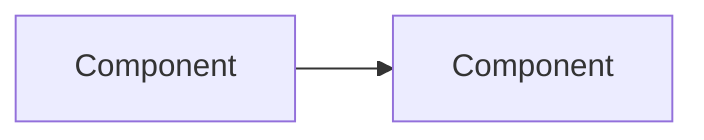

# [Project Name]

- **Code:** [3-letter identifier]
- **Status:** Ideation | Planning | Implementation | Review | Done | Parked
- **Priority:** Q1 | Q2 | Q3 | Q4
- **Lead:** [Persona name]
- **Created:** YYYY-MM-DD
- **Last updated:** YYYY-MM-DD
- **Current phase started:** YYYY-MM-DD

## Overview
[1-2 sentences: what this project is and why it exists]

## Architecture

## Current State
[What's done, what's next, any blockers]
